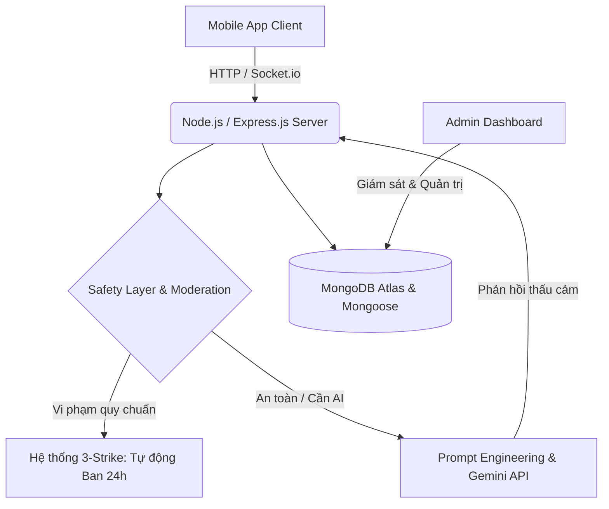

# 🧠 MindWell Backend: AI-Powered Mental Health API & WebSocket

  

>  Phân hệ Backend cốt lõi xử lý luồng dữ liệu thời gian thực, kiểm duyệt cộng đồng tự động và giao tiếp với Trí tuệ Nhân tạo.
> 
> 🔗 **[Mã nguồn Backend (RESTful API & Socket)](https://github.com/pham-anh-tuann/mindwell-server)**
> 
> 📱 *Xem mã nguồn phân hệ Frontend (Mobile App) [tại đây](https://github.com/pham-anh-tuann/mindwell-app).*
> 

## 📐 Kiến trúc Hệ thống & Sơ đồ Luồng (System Architecture)
Hệ thống được thiết kế theo mô hình RESTful API kết hợp Real-time WebSocket, phân tách rõ ràng luồng dữ liệu tức thời và các tác vụ chạy ngầm.

🛠️ Công nghệ & Ngăn xếp (Tech Stack)
Core: Node.js, Express.js (Triển khai trên Render).

Database: MongoDB (Atlas) & Mongoose ORM.

Real-time & AI: Socket.io, Gemini API / OpenAI API.

Security & Background Tasks: JWT (JSON Web Token), bcryptjs, Node-Cron.

🧠 Quyết định Kỹ thuật Cốt lõi & Phân tích Đánh đổi (Trade-off Analysis)
1. Real-time Community Chat (Socket.io)
Kiến trúc: Sử dụng Socket.io để đồng bộ hóa tin nhắn tức thời, tối ưu hóa sự kiện cho các tác vụ thả emoji và thu hồi tin nhắn.

Trade-off Analysis: Cải thiện tối đa độ trễ (latency) so với HTTP Polling, nhưng đánh đổi bằng việc tiêu tốn bộ nhớ RAM để duy trì các kết nối TCP mở liên tục. Để đạt được High Availability (HA) khi lượng người dùng tăng vọt, kiến trúc cần tích hợp thêm Load Balancer.

2. Automated Moderation System (Hệ thống "3-Strike")
Kiến trúc: Thiết lập Middleware can thiệp vào luồng tin nhắn trước khi lưu trữ xuống Database, che mờ từ ngữ vi phạm. Áp dụng logic "3-Strike": Tự động khóa quyền chat (Ban) 24 giờ khi tài khoản chạm ngưỡng 3 lần vi phạm.

Impact: Tự động hóa hoàn toàn quy trình quản trị rủi ro, bảo vệ an toàn cộng đồng mà không cần nguồn lực kiểm duyệt thủ công.

3. Background Tasks & Future Scalability
Kiến trúc: Sử dụng node-cron để tự động hóa các tác vụ lặp lại (Reset dữ liệu, gửi thông báo).

Scalability: Triển khai Cronjob trên cấu trúc Monolith hiện tại hoạt động rất tốt và tiết kiệm chi phí. Trong tương lai, khi mở rộng thành Hệ thống phân tán (Distributed Systems), các tác vụ này sẽ được áp dụng Event-Driven Architecture, giao tiếp qua Message Brokers để đảm bảo đồng bộ dữ liệu.
